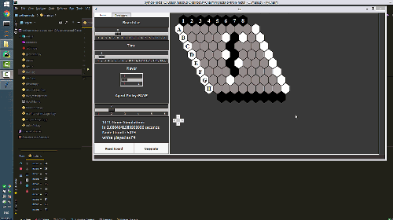

# Monte-Carlo-Tree-Search-Agent-for-the-Game-of-HEX

## Demo:

 

### Description
This is the code for my paper **:link: [IMPROVING MONTE CARLO TREE SEARCH BY COMBINING 
RAVE AND QUALITY-BASED REWARDS ALGORITHMS](https://www.civilica.com/Paper-CONFITC04-CONFITC04_172.html)**.

Researches have been done in **Urmia University of Technology**.

    

#### Authors: 
- Masoud Masoumi Moghadam (Me :sunglasses:), 
- Prof: Mohammad Pourmahmood Aghababa, 
- Prof: Jamshid Bagherzadeh

## What is monte carlo tree search anyway?
MONTE Carlo Tree Search (MCTS) is a method for finding optimal decisions in a given domain by
taking random samples in the decision space and building a search tree according to the results.
It has already had a profound impact on Artificial Intelligence (AI) approaches for domains that
can be represented as trees of sequential decisions, particularly games and planning problems. 
In this project I used different simulation strategies to enhance the agent policy to explore the environment.

# Requirements
- OS: Windows  and Ubuntu
- tkinter
- Numpy

Another implementation boosted with Cython and C wrappers can be found in here:

:link: [Monte Carlo Tree Search boosted with cython](https://github.com/masouduut94/MCTS-agent-cythonized)
## How to run it? :running:

You can :running: (run) program using this command:

    python main.py

Also you can run tests for comparing two mcts-based algorithms against 
each other using the `playtest.py`.

## :closed_book: To know more about MCTS:

This one is highly recommended: 

:link: [A Survey of Monte Carlo Tree Search Methods](http://ieeexplore.ieee.org/abstract/document/6145622/)

## Algorithms used for boosting MCTS in this framework: 

- Upper Confidence Bounds (UCT)
- UCB1-Tuned
- Rapid Action Value Estimation (RAVE)
- Decisive Move 
- Quality Based Rewards
- Pool RAVE
- Last Good Reply
